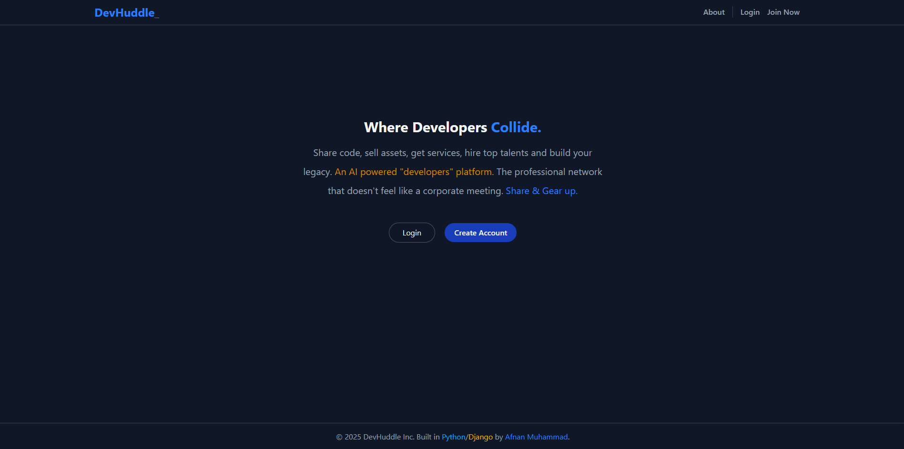
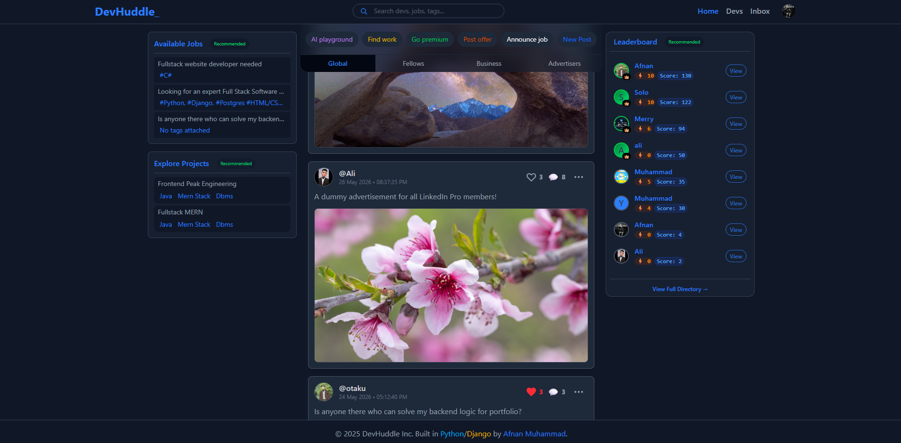
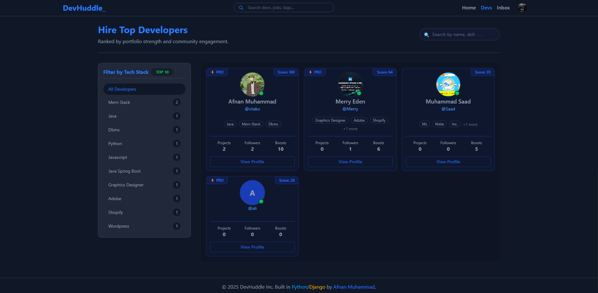
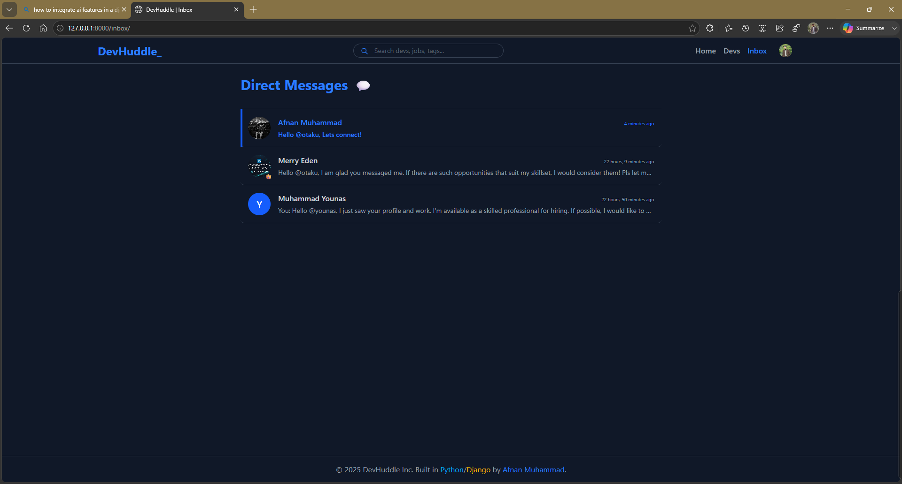
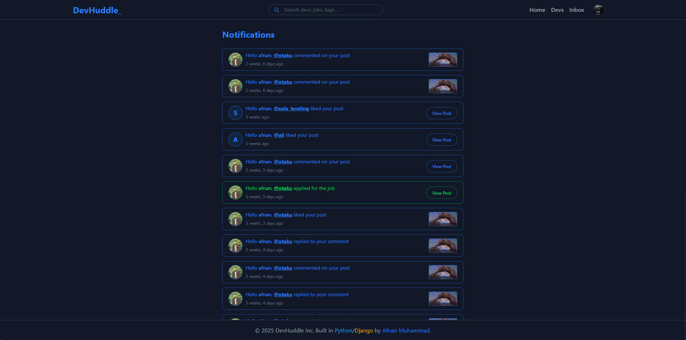
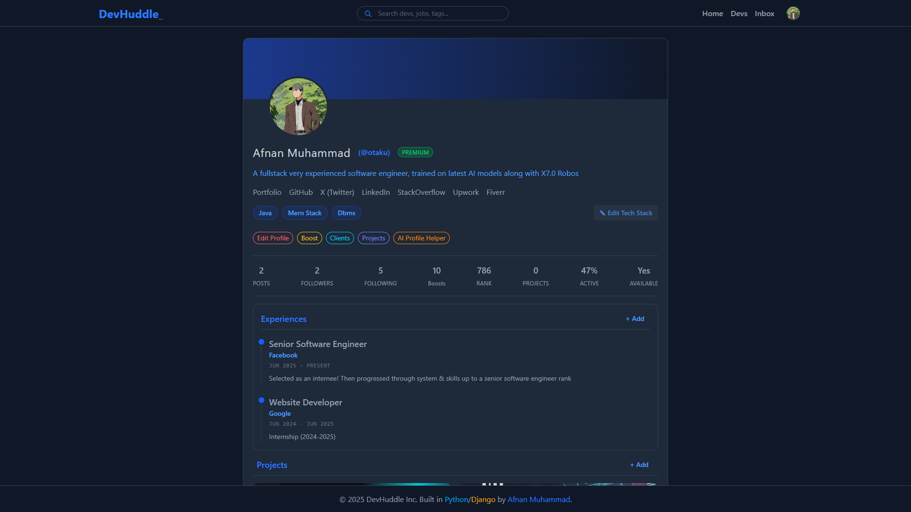
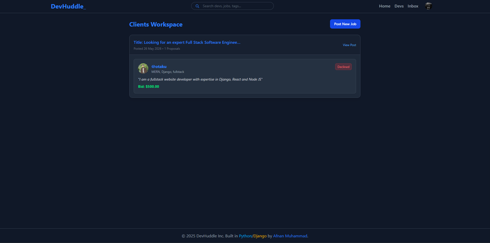
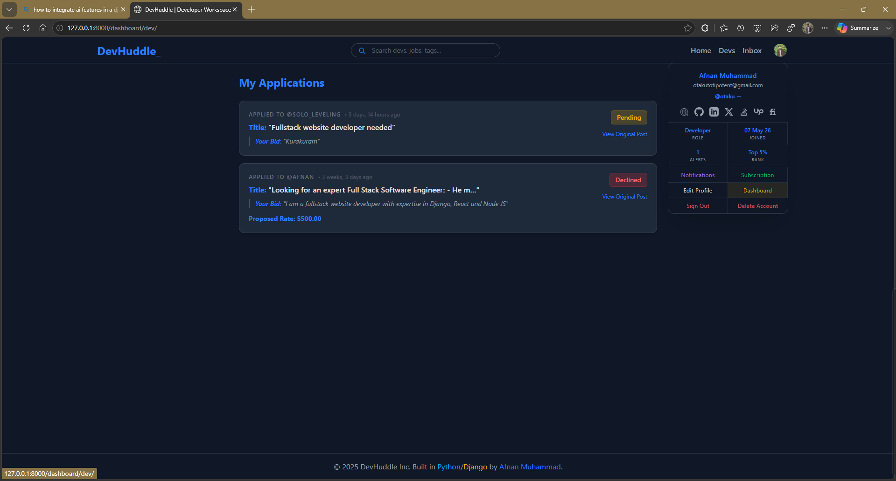
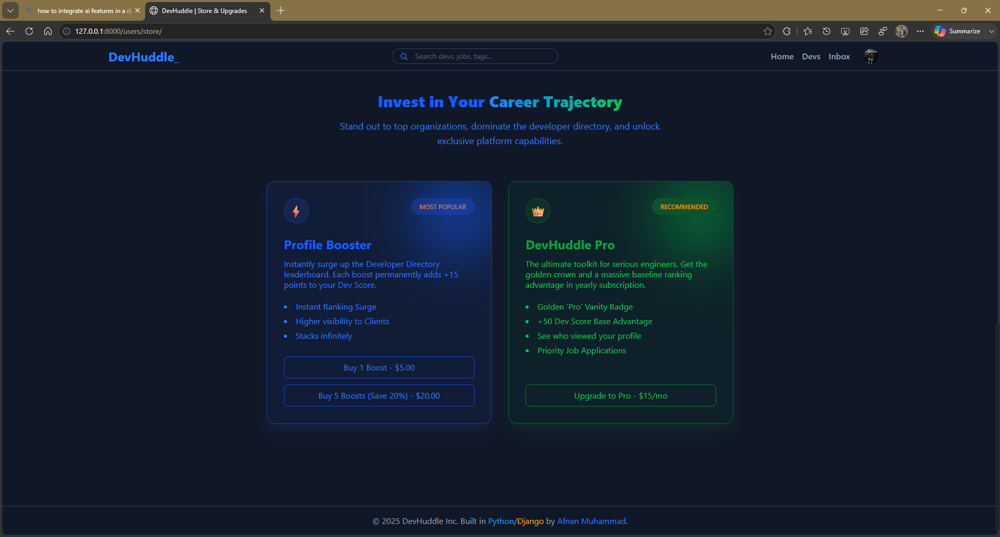
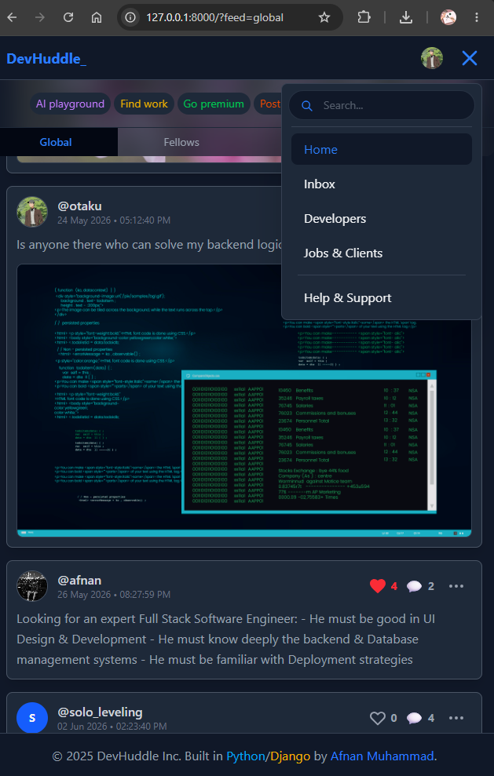

# Notes About DevHuddle

This document contains various notes and ~~observations~~/guidelines regarding "DevHuddle" platform, including future improvements, new features, fixes, and general concepts.

## Live ?

- [Click here to jump to the Previews section.](#preview)
- Project is under maintenance.
- Discuss in private? DM [@LinkedIn](https://www.linkedin.com/in/afnanmuhammad "linkedin/afnanmuhammad")

## Setup & Installations

- Install **Python** if not already
- Open project in IDE/Terminal ~~(like VSCode/Powershell)~~
- Create Python Virtual Environment, and activate it:

```python
python -m venv .venv
.venv\Scripts\Activate
```

- Install _Python Dependencies_:

```python
pip install -r requirements.txt
```

- Install _TailwindCSS_ & other _JS Dependencies_ (use separate/independent terminal window):

```js
npm install
```

- Run project (Python oriented terminal window),(Run following commands separately, one by one). The last command will give a link address to be used (copy/paste to any browser):

```cmd
python manage.py makemigrations
python manage.py migrate
python manage.py createsuperuser
python manage.py runserver
```

- Run JS related libs as follows (Tailwind requires continuous background running):

```cmd
npx @tailwindcss/cli -i ./static/css/custom.css -o ./static/css/output.css --watch
```

## Dev: Extensions Used

- [djLint](https://marketplace.visualstudio.com/items?itemName=monosans.djlint)
- [Python Extensions Pack](https://marketplace.visualstudio.com/items?itemName=donjayamanne.python-extension-pack)
- [ESLint](https://marketplace.visualstudio.com/items?itemName=donjayamanne.python-extension-pack)
- [Django](https://marketplace.visualstudio.com/items?itemName=donjayamanne.python-extension-pack)
- [Markdownlint](https://marketplace.visualstudio.com/items?itemName=donjayamanne.python-extension-pack)
- [TailwindCSS Intelligence](https://marketplace.visualstudio.com/items?itemName=donjayamanne.python-extension-pack)

## Major Fixes

- Prepare documentation for this project
- Add API endpoints for developers

## Improvements \& Suggestions

- Add Notifications tone/music
- Add Recycle bin page for recovering data within 3 days
- Implement light theme.

## Preview











